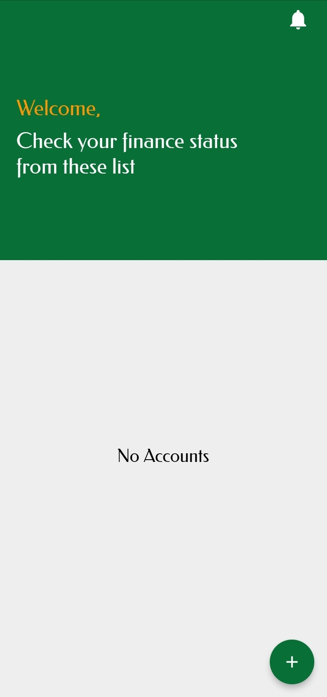
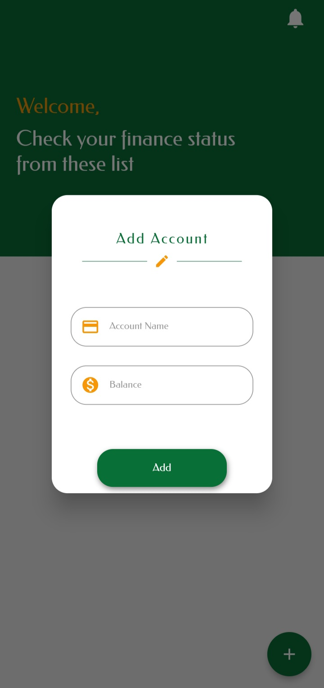
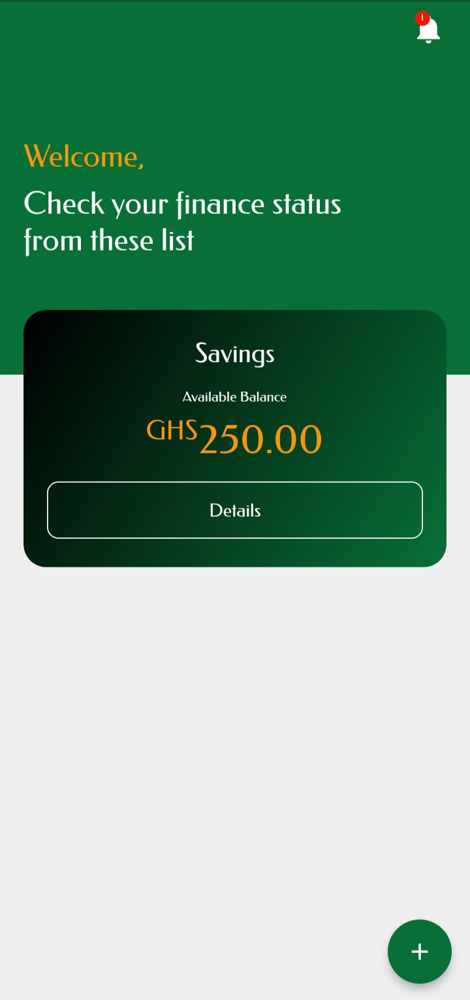
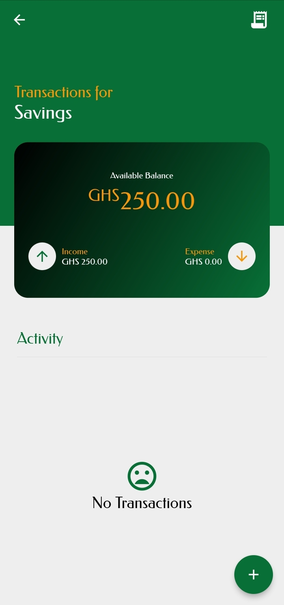
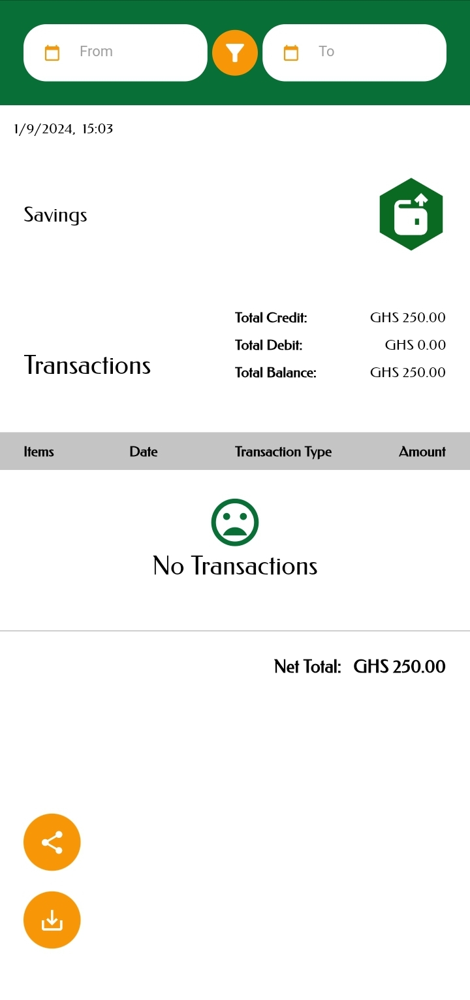

# Flutter Expense Tracker

Welcome to Flutter Expense Tracker! This Flutter-based app helps users track their expenses and manage their finances effectively.

## Overview
Flutter Expense Tracker is a user-friendly application that allows individuals to monitor their spending, categorize expenses, set budgets, and visualize their financial habits.

## Requirements
- Flutter SDK
- Dart SDK
- Other dependencies mentioned in `pubspec.yaml`

## Features
- Add, edit, and delete expenses
- Categorize expenses (e.g., food, transportation, entertainment)
- View expense history and summaries
- Set monthly or weekly budgets
- Visual representation of expenses through charts or graphs
- Export or share expense reports

## Links
- [GitHub Repository](https://github.com/your-username/FlutterExpenseTracker)
- [Demo Video](https://your-demo-video-link.com)

## Screenshots

| Splash Screen | Home Screen | Add Account |
|-------------|-------------|-----------------|
|  |  |  |

| New Account | Transaction List | Summary |
|-------------|-------------|-----------------|
|  |  |  |

## How to Use
- Add expenses by entering details such as amount, category, and description.
- View expense history and summary to analyze spending habits.
- Set budgets to manage and control spending within specific categories.
- Edit or delete expenses as needed.

## Major Packages
- `provider: ^x.x.x`
- `intl: ^x.x.x`
- `localstorage: ^x.x.x`
- Other packages as listed in `pubspec.yaml`

## Authors
-   [Collins A. B. Brobbey Jnr](https://www.linkedin.com/in/collins-a-b-brobbey-jnr-27253810b)
-   Email - [brobbeycollins96@gmail.com]
-   [Jeffrey K. Boahen](https://www.github.com/yellow-Flickr)
-   Email - [jeffboach@gmail.com]
